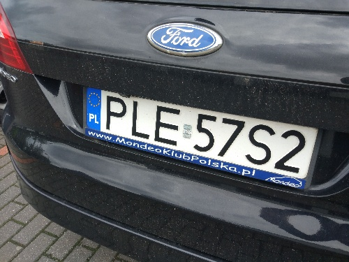

# Licence-Plate-Recognition

## Goal
The goal of the project was to create a script that is able to read Polish licence plates using OpenCV library
## Assumptions
* Horizontal and vertical angle of the presented licence plate may vary by +- 45 degrees
* Longer side of licence plate is at least 1/3 size of the image
* All licence plates have 7 characters
* The resolution of images may vary

## Requirements
* Python 3.7
* Processing time of each image may not extend 2\*images seconds (Specifications of the testing PC were unknown but it was pretty modern for the time of making this project)
* All libraries were available.
* In case of using machine learning, the model must be trained using the available calculation time. (The project was tested on around 50 images)

## Results
Private Set (49 images):
* Detected characters 99.41% (341/343)
* Properly recognised characters 96.79% (332/343)
* Overall score 93.46% (458/490)

Unknown Set (~50 images):
* Overall score 78.91%

Score system:
* +1 point per recognised character
* +3 points if all 7 characters were recognised
* A character is scored if it's placed in a right place in the output string

## How does it work?
### Preprocess image
* Initially, the image gets resized so it doesnt get processed in an unnecessarily big format.
### Find characters
Image gets thresholded multiple times with a different threshold value. During each iteration:
* Use Opening morphology in order to get rid of small noise and reduce the number of calculation
* Use findCountours function to draw contours and determine their hierarchy
* Use the contours to find bounding boxes
* Cut the image in multiple horizontal lines, for every line check:
  * If it intersects with at least 4 bounding boxes. If it does, increase intersected boxes' score by one.
  * Save the dimensions of each bounding box for the next iteration. If the dimensions don't change significantly, the bounding box is still considered to be the same object and its score is saved for the next iterations. 
* The first 7 objects with the highest scores are considered as characters

### Cleaning characters
* Use otsu binarisation to get rid of the noise on each character and convert it into a binary image

### Character classification
* Use connectedComponents function to find the biggest object on each character's image which most likely is the character itself
* Use warpPerspective in order to try rotate the character into its original pose
* Resize each character into a 50x50 image
* Use bitwise_xor function and compare each image with each, previously prepared character
* The character with the lowest score is considered the character on the image. But before that happens, a few more operations are done:
  * Calculate the top/bottom pixel ratio and compare it with the letter's true values.
  * Check if the possible combination of letters and numbers exists. If not then get rid of the mismatched character and try to find the matching one with the lowest score

